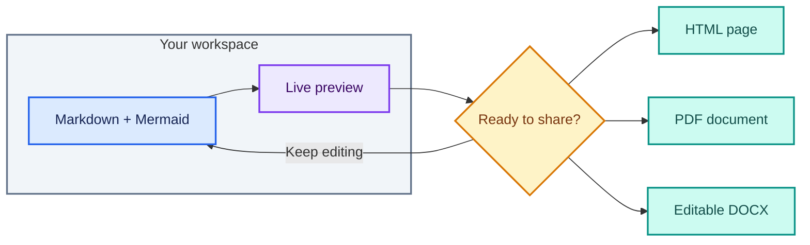

# Your ideas. Ready to share.

Keep writing in **Notepad++**. See your Markdown, code and diagrams come together.

```mermaid
flowchart LR
    subgraph WORK["Your workspace"]
        A["Markdown + Mermaid"] --> B["Live preview"]
    end
    B --> C{"Ready to share?"}
    C -->|Keep editing| A
    C --> H["HTML page"]
    C --> P["PDF document"]
    C --> D["Editable DOCX"]
    classDef source fill:#dbeafe,stroke:#2563eb,color:#172554,stroke-width:2px
    classDef preview fill:#ede9fe,stroke:#7c3aed,color:#3b0764,stroke-width:2px
    classDef choice fill:#fef3c7,stroke:#d97706,color:#78350f,stroke-width:2px
    classDef output fill:#ccfbf1,stroke:#0d9488,color:#134e4a,stroke-width:2px
    class A source
    class B preview
    class C choice
    class H,P,D output
    style WORK fill:#f1f5f9,stroke:#64748b,stroke-width:2px
```

> [!TIP]
> Switch the theme. Zoom in. The diagram stays part of your document.
