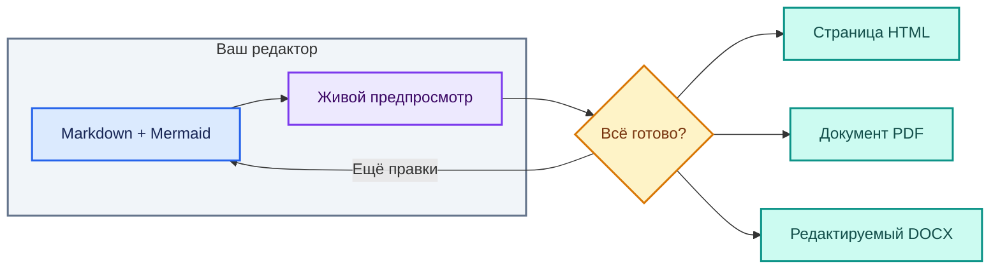

# Ваши идеи. Готовы к отправке.

Продолжайте писать в **Notepad++**. Markdown, код и диаграммы складываются в документ.

```mermaid
flowchart LR
    subgraph WORK["Ваш редактор"]
        A["Markdown + Mermaid"] --> B["Живой предпросмотр"]
    end
    B --> C{"Всё готово?"}
    C -->|Ещё правки| A
    C --> H["Страница HTML"]
    C --> P["Документ PDF"]
    C --> D["Редактируемый DOCX"]
    classDef source fill:#dbeafe,stroke:#2563eb,color:#172554,stroke-width:2px
    classDef preview fill:#ede9fe,stroke:#7c3aed,color:#3b0764,stroke-width:2px
    classDef choice fill:#fef3c7,stroke:#d97706,color:#78350f,stroke-width:2px
    classDef output fill:#ccfbf1,stroke:#0d9488,color:#134e4a,stroke-width:2px
    class A source
    class B preview
    class C choice
    class H,P,D output
    style WORK fill:#f1f5f9,stroke:#64748b,stroke-width:2px
```

> [!TIP]
> Меняйте тему и масштаб. Схема остаётся частью вашего документа.
