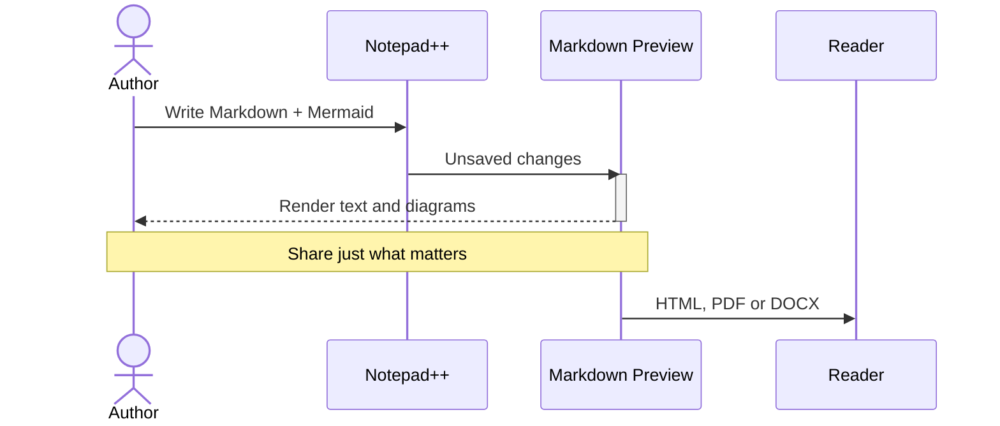

# A clearer conversation

A sequence diagram turns a workflow into something everyone can follow.

```mermaid
sequenceDiagram
    actor Author
    participant Editor as Notepad++
    participant Preview as Markdown Preview
    participant Reader
    Author->>Editor: Write Markdown + Mermaid
    Editor->>Preview: Unsaved changes
    activate Preview
    Preview-->>Author: Render text and diagrams
    deactivate Preview
    Note over Author,Preview: Share just what matters
    Preview->>Reader: HTML, PDF or DOCX
```
