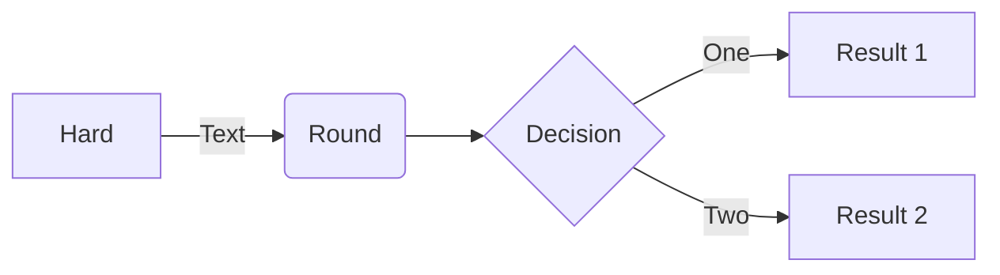
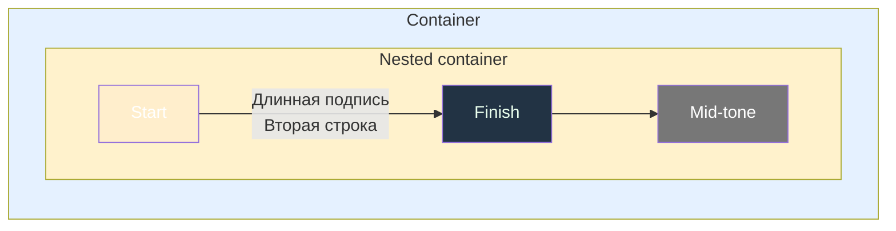
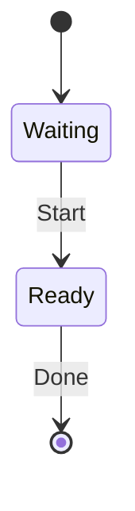
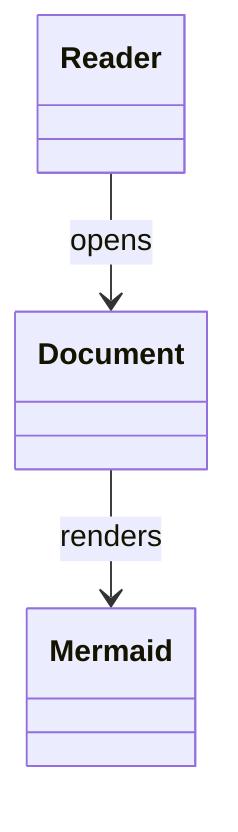

# Arrow label backgrounds

```mermaid
flowchart LR
  A[Hard] -->|Text| B(Round)
  B --> C{Decision}
  C -->|One| D[Result 1]
  C -->|Two| E[Result 2]
```

```mermaid
flowchart LR
  subgraph OUTER[Container]
    subgraph INNER[Nested container]
      A[Start] -->|Длинная подпись<br/>Вторая строка| B[Finish]
      B --> C[Mid-tone]
    end
  end
  style OUTER fill:#e5f1ff
  style INNER fill:#fff2cc
  style A fill:#ffeecc,color:#ffffff
  style B fill:#223344,color:#eaffee
  style C fill:#777777,color:#ffffff
```

```mermaid
stateDiagram-v2
  [*] --> Waiting
  Waiting --> Ready: Start
  Ready --> [*]: Done
```

```mermaid
classDiagram
  Reader --> Document : opens
  Document --> Mermaid : renders
```
