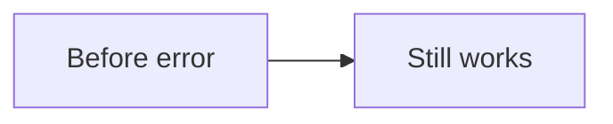
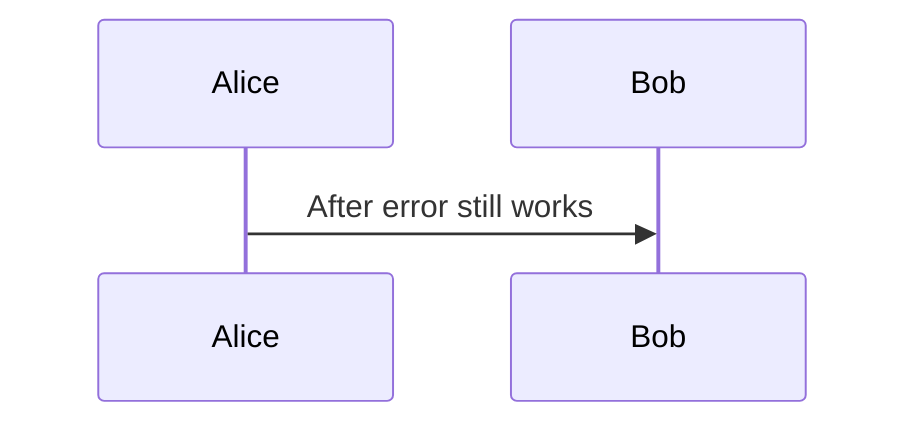

# Mermaid error isolation

```mermaid
flowchart LR
    A[Before error] --> B[Still works]
```

```mermaid
flowchart LR
    A[Unclosed
```

```mermaid
sequenceDiagram
    Alice->>Bob: After error still works
```
