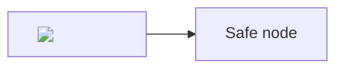

# Mermaid security fixture

```mermaid
%%{init: {"securityLevel":"loose","themeCSS":"body { display: none !important; }","dompurifyConfig":{"ADD_TAGS":["script"]}}}%%
flowchart LR
    A["<img src=x onerror=alert(1)>"] --> B[Safe node]
    click A call alert() "unsafe callback"
```

Normal document content stays visible.
